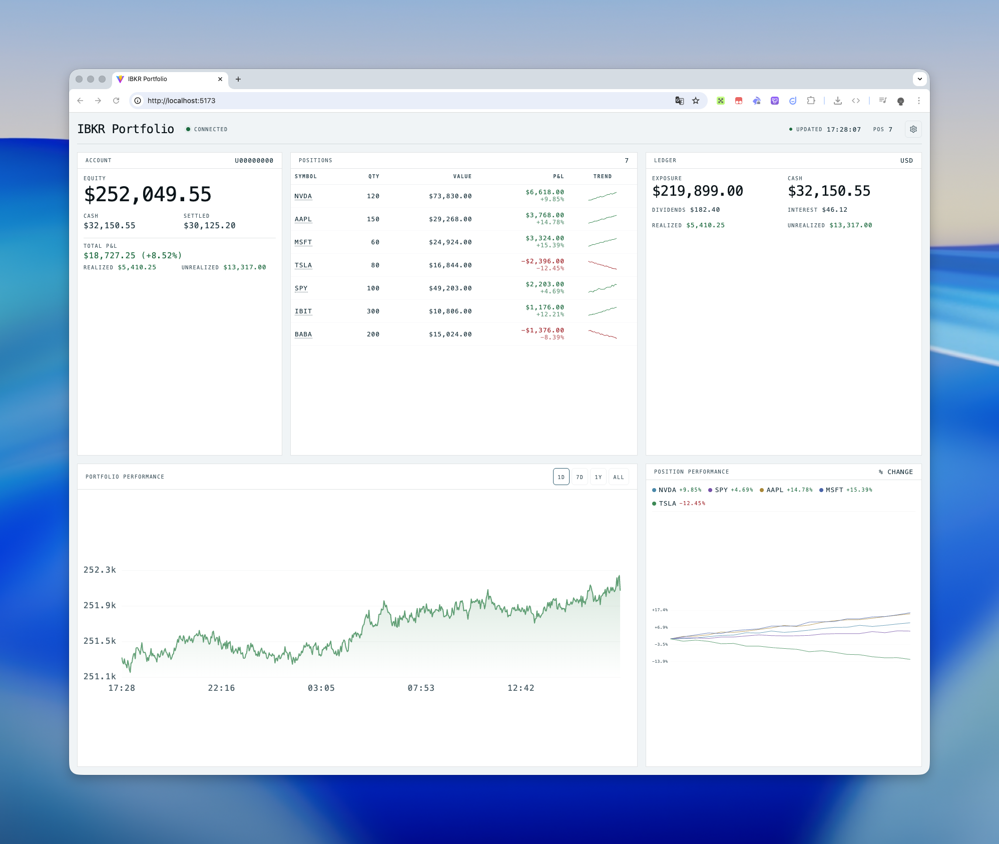
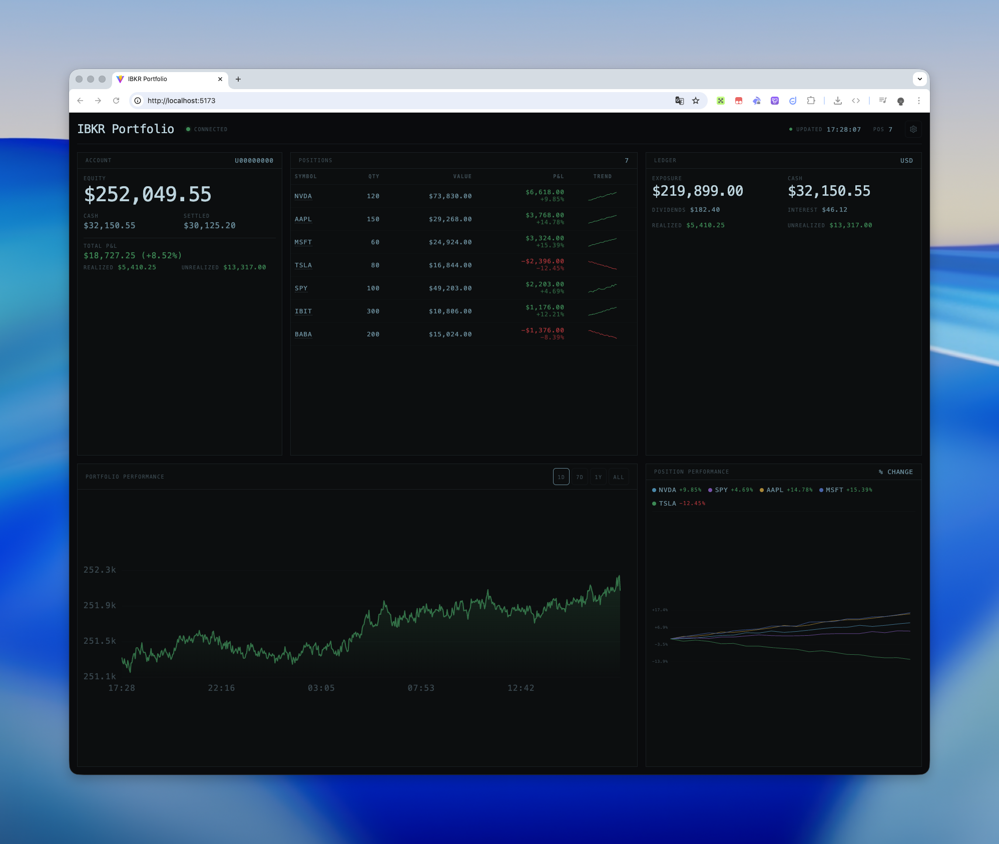

# Portfolio-IBKR

[中文说明](./README_zh.md)




An IBKR portfolio dashboard built with **Bun + Hono + React (Vite)**. It fetches account info / positions / ledger from the IBKR Web API and stores **equity snapshots** in **SQLite** for charting.

## Runtime configuration (Docker-friendly)

This project is designed to be open-sourced without committing secrets or local data. The following are configurable at **container runtime**:

- App title (`PORTFOLIO_TITLE`)
- IBKR OAuth config file path (`IBKR_OAUTH_PATH`, mount your `oauth.json`)
- SQLite file path (`PORTFOLIO_DB_PATH`, mount a persistent volume)

## Environment variables

- `PORT`: Server port (default: `3000`)
- `PORTFOLIO_TITLE`: UI title (default: `IBKR Portfolio`)
- `PORTFOLIO_MOCK`: Enable built-in demo data (default: `false`)
- `MOCK_ACCOUNT_ID`: Demo account id (default: `U00000000`)
- `MOCK_SEED`: Demo data seed (default: `0`)
- `IBKR_OAUTH_PATH`: Path to IBKR OAuth config JSON (default: `oauth.json`)
- `PORTFOLIO_DB_PATH`: SQLite file path for equity snapshots (default: `data/ibkr-portfolio.sqlite`)
- `IBKR_ACCOUNT_ID`: Optional fallback account id (used only if some endpoints are called without `?accountId=`)

## Demo / mock mode (for screenshots)

If you just want screenshots or to try the UI without real IBKR data, enable mock mode.
In this mode, **no `oauth.json` is needed**, and the backend serves built-in demo account/positions/ledger/history.

```bash
PORTFOLIO_MOCK=1 PORTFOLIO_TITLE="Demo Portfolio" bun run dev
```

Docker:

```bash
docker run --rm -p 3000:3000 \
  -e PORTFOLIO_MOCK=1 \
  -e PORTFOLIO_TITLE="Demo Portfolio" \
  portfolio-ibkr
```

## Local development

### Prerequisites

- [Bun](https://bun.sh/) (this repo is tested with Bun `1.2.x`)
- IBKR Web API access + OAuth config (see below)

### Start

```bash
bun install
bun run dev
```

- Frontend: `http://localhost:5173`
- API server: `http://localhost:3000` (Vite proxies `/api` to this server)

## IBKR OAuth config (`oauth.json`)

This app uses the [`ibkr-client`](https://www.npmjs.com/package/ibkr-client) package.

You need an OAuth config JSON file (DO NOT commit it).

> Note: OAuth direct access is typically available only to **institutional** users. `ibkr-client` currently supports **OAuth 1.0a** (OAuth 2.0 may come later).

- Use the template in `oauth.example.json`, fill in your values, save as `oauth.json`
- Generate it with `ibkr-client` (OAuth 1.0a):
  1. Make sure `openssl` is installed.
  2. Follow the IBKR OAuth setup instructions to obtain **3 files** and **3 strings**:
     - Files: `dhparam.pem`, `private_encryption.pem`, `private_signature.pem`
     - Strings: `Consumer Key`, `Access Token`, `Access Token Secret`
  3. Go to the module directory, copy the 3 files into it, and run the generator:

     ```bash
     cd node_modules/ibkr-client
     # put dhparam.pem / private_encryption.pem / private_signature.pem here
     node configure.js
     ```

  4. Enter the 3 strings when prompted. The script generates `oauth1.json`.
  5. Store the generated file in a secure location, then either:
     - Copy/rename it to your project root as `oauth.json`, or
     - Keep the name/path and set `IBKR_OAUTH_PATH` to point to it.

## Docker deployment

### Build

```bash
docker build -t portfolio-ibkr .
```

### Run

Mount your OAuth file and persist `/app/data` for SQLite:

```bash
docker run --rm -p 3000:3000 \
  -e PORTFOLIO_TITLE="My Portfolio" \
  -e IBKR_OAUTH_PATH=/app/oauth.json \
  -e PORTFOLIO_DB_PATH=/app/data/ibkr-portfolio.sqlite \
  -v "$(pwd)/oauth.json:/app/oauth.json:ro" \
  -v portfolio_ibkr_data:/app/data \
  portfolio-ibkr
```

Then open `http://localhost:3000`.

## Notes

- SQLite uses WAL mode, so you will also see `*.sqlite-wal` and `*.sqlite-shm` next to your DB file.
- `oauth.json`, `.env`, and `data/` are already in `.gitignore`.
- This project talks to a trading API. Treat secrets carefully and use at your own risk.
